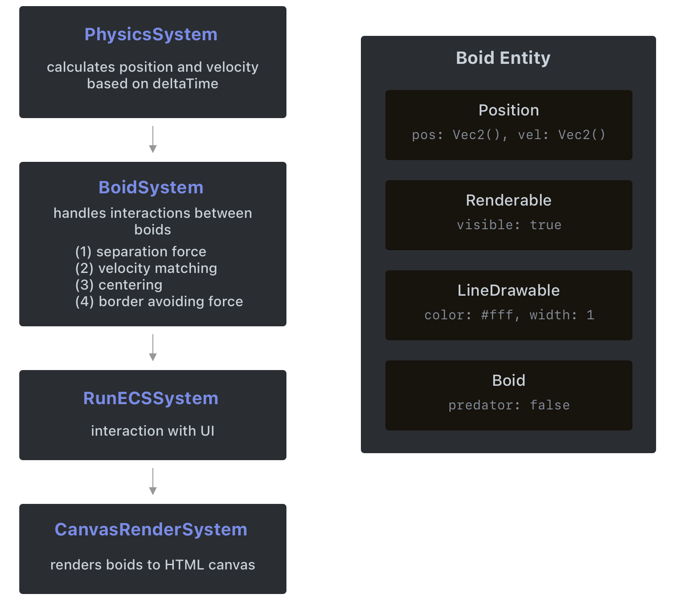

# 🐦 Boids 🐦

Experimental boid simulation with a custom Entity Component System, see on the [Online Demo](https://krystex.github.io/Boids/).

https://user-images.githubusercontent.com/5840423/208698278-3c944ab0-d516-487c-8c22-016e5839dc9f.mov

Implemented to study the Entity Component System pattern.
Everything is implemented in vanilla JS, including a tiny linear algebra library.

To run the project locally, simply clone the repository and open `index.html`.

<p align="center">
  
</p>

---

The **entity component system** has three essential primitives:
- **Entity**: basic object in scene, e.g. a `Boid`. it has no data by itself
- **Component**: data which describes behaviour, e.g. `LineRenderable` with attributes color and width. component has only data, no actual behaviour 
- **System**: actually implemented behaviour, e.g. `PhysicsSystem` which handles physics calculations

See for yourself:
```javascript
// construct Entity Component System with global variable `bound`
const ecs = new ECS({bound: new Vec2(400, 400)})

// construct physics components which has position and velocity of object
const WorldComponent = new Component("world", {pos: new Vec2(), vel: new Vec2()})

// construct system for handling physics
class PhysicsSystem extends System {
  constructor(ecs) {
    // PhysicsSystems is bound to entities which have WorldComponent
    super([WorldComponent])
    // can access global variable
    this.bounds = {minx: 0, miny: 0, maxx: ecs.globals.bound.x, maxx = ecs.globals.bound.y} 
  }

  // handler which is executed before tick
  beforeTick(_) {}

  // this method gets executed for every entity
  onEntity(ecs, entity) {
    // physics calculations
  }
}

// create and add entity to ECS
const exampleEntity = new Entity([WorldComponent])
ecs.addEntities([exampleEntity])
// add system to ECS
ecs.addSystems([PhysicsSystem])
// initialize ECS (creates actual systems)
ecs.init()
// run ECS in endless loop
ecs.run()
```


## Lessons learned
- it's pretty cool to decouple objects from the actual logic
- however, data interaction between different systems can be messy (`BoidSystem` modifies velocity vector, `PhysicsSystem` applies velocity too)
- therefore, processing order is important
- sometimes it's hard to decide to choose where the code is gonna go
- shared mutable state can be a problem. what are my entities doing?
- this has nothing to do with the ECS, but linear algebra in JS is not great to work. no operator overloading is not nice


## Resources
[1] https://www.cs.toronto.edu/~dt/siggraph97-course/cwr87/

[2] https://github.com/beneater/boids